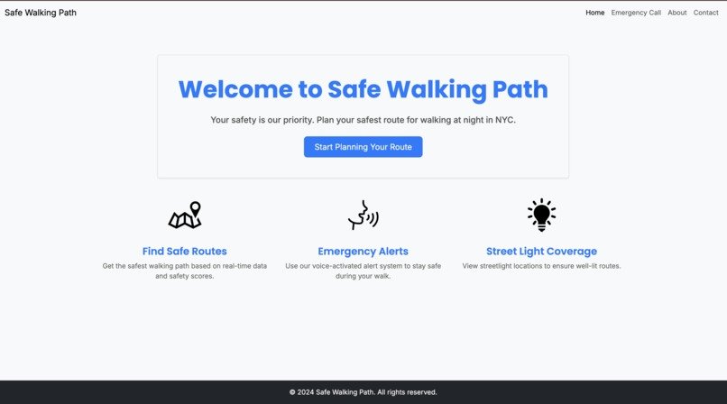
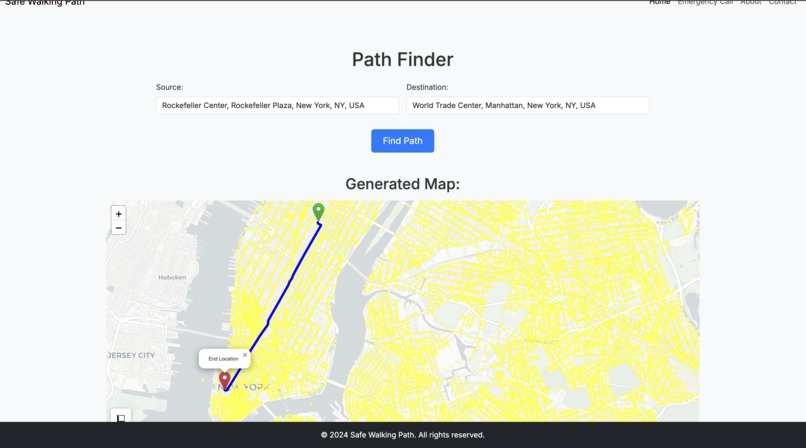
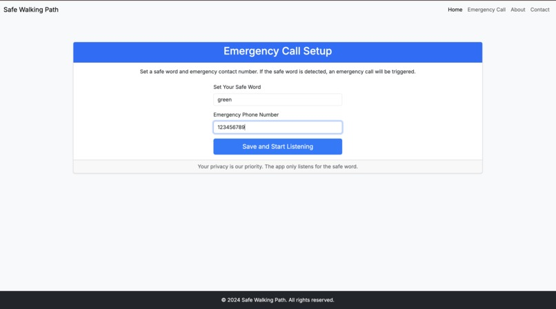
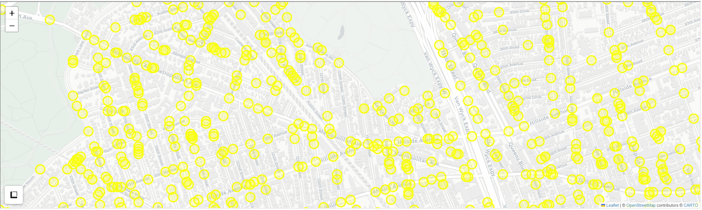

# future-of-data-hackathon  MidWestCon 2024   
# Safe Walking Path  
### An AI based pedestrain routing app intended to provide safer path options for pedestrains considering the past crime data of the neighborhood, time of the day and lighting(day light and streetlights)   
### Features:  
#### 1. Safer Path(Route) between the source and destination using AI  

#### 2. An Emergency Calling Mechanism triggered on uttering a specific safe word(set by the user) while using the app. It leverages speech recognition techniques to identify the safe word and make an emergency call  

#### 3. Displays the Streetlight Coverage for every route within the map (all the yellow things on the map)

